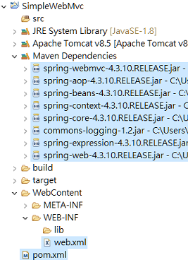

### Dispatcher Servlet

Spring MVC 的核心觀念之一就是 Dispatcher Servlet，簡單來說 Spring MVC Framework 的設計圍繞者這個 Dispatcher Servlet，它的功用在於在最前線將所有的 request 分派到正確的 handler，分派的機制由我們去設定，由 Dispatcher Servlet 去執行，它就是一個在最前線的 Controller，單獨的接收 Http 請求，分派到 application 的其他 controller 或是 handler。


### 範例
現在建立一個最基本的 Spring MVC Web 專案，在 Eclipse 新增一個 Dynamic Web Project，建立好的專案下有一個目錄叫作 WebContent，裡面有 WEB-INF 的目錄，在 WEB-INF 之下可以需要新增一個 .xml 檔，名字取為 `web.xml` (名稱必須為 web.xml)

步驟 : 1> [NEW] -->

為了要匯入 Spring MVC 相關的 jar 檔，建議將專案 configure 成 Maven Project，接下來就可以在 Pom.xml 裡加上 Spring MVC 所需要的 Dependency，要使用 Spring Web 以及要 Servlet 的支援，就必須加入以下兩個 Dependency。

1. <a href="https://mvnrepository.com/artifact/org.springframework/spring-web" target="_blank">spring-web</a>
2. <a href="https://mvnrepository.com/artifact/org.springframework/spring-webmvc" target="_blank">spring-webmvc</a>

`spring-web` 包含了一些很常用的 web 及 servlet 的功能，而 `spring-webmvc` 提供 servlet 環境正常的 MVC 支援，
不過由於 `spring-webmvc` 已經有 `spring-web` 作為它的 dependency 之一了，所以當我們在使用 `spring-webmvc` 時就可以不需要 spring-web，因此其實 dependency 加入 `spring-webmvc` 即可。

```
<dependency>
    <groupId>org.springframework</groupId>
    <artifactId>spring-web</artifactId>
    <version>4.3.10.RELEASE</version>
</dependency>
<dependency>
    <groupId>org.springframework</groupId>
    <artifactId>spring-webmvc</artifactId>
    <version>4.3.10.RELEASE</version>
</dependency>
```



### web.xml

web.xml 是....

設定 :
在 package explorer `web.xml` 點右鍵，[new] -> 選[other] -> 然後在精靈 wizard 輸入 servlet，然後在 create servlet 的視窗裡勾選 Use existing Servlet Class or Jsp -> 選擇 Dispatcher Servlet。 


當新增成功後，`web.xml` 應該會多這段 code

```
  <servlet>
    <description></description>
    <display-name>DispatcherServlet</display-name>
    <servlet-name>DispatcherServlet</servlet-name>
    <servlet-class>org.springframework.web.servlet.DispatcherServlet</servlet-class>
  </servlet>
  <servlet-mapping>
    <servlet-name>DispatcherServlet</servlet-name>
    <url-pattern>/DispatcherServlet</url-pattern>
  </servlet-mapping>
```

說明 : 要說明為什麼要新增這一段就要說明 <a href="https://docs.spring.io/spring-framework/docs/current/javadoc-api/org/springframework/web/servlet/DispatcherServlet.html" target="_blank">`Dispatcher Servlet`</a>
