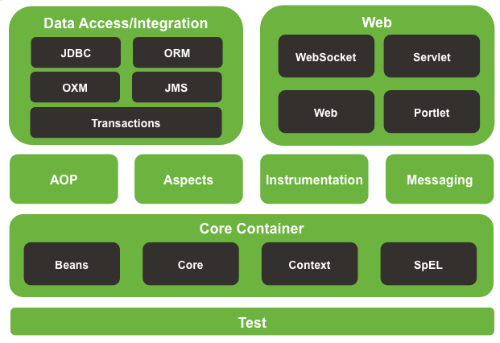

<a href="/spring/">Spring</a> >>
<a href="/spring/spring_page1/">Spring 簡介</a> >>
<a href="/spring/spring_page2/">Spring Container</a> >> <a href="/spring/spring_page3/">Spring Beans</a> >> <a href="/spring/spring_page4/">Dependency Injection</a>

<a href="/spring/spring_mvc_page01/">Spring MVC介紹</a> >> 
<a href="/spring/spring_mvc_page02/" style="color:palevioletred;background-color:papayawhip;">Controllers</a>

<div class="divider"></div>
### Controllers
在 src 目錄下加入一個新的 package 並建立一個 Class 叫作 TestController :

```
package com.example.controller;

import org.springframework.stereotype.Controller;
import org.springframework.web.bind.annotation.RequestMapping;

@Controller
public class TestController{
	@RequestMapping(value="/TestController/test")
	public void test(){
		System.out.println("hi???");
	}
}
```

在 `DispatcherServlet-servlet.xml` 檔加入該行程式 : 

```
<context:component-scan base-package="com.example.controller" />
```

<!---->
