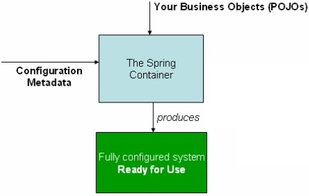

<a href="/spring/">Spring</a> >>
<a href="/spring/spring_page1/">Spring 簡介</a> >>
<a href="/spring/spring_page2/" style="color:palevioletred;background-color:papayawhip;">Spring Container</a> >> <a href="/spring/spring_page3/">Spring Beans</a> >>
<div class="divider"></div>
### 何謂 Spring Container?
Spring Container 是整個 Spring framework 的核心，該 Container 負責管理、建立、並 mapping container 裡的物件，透過 Dependency injection 來管理這些物件並拿來應用，同時 Container 也需要讀取相關設定(不論是透過 XML 或是 Java code 或是 annotation)，告訴 container 要建立和初始化那些物件。



Spring 有兩種 Container 分別為 : 
1. **<a href="https://docs.spring.io/spring/docs/current/javadoc-api/org/springframework/beans/factory/BeanFactory.html" target="_blank">BeanFactory</a>**
2. **<a href="https://docs.spring.io/spring/docs/current/javadoc-api/org/springframework/context/ApplicationContext.html" target="_blank">ApplicationContext</a>**

| Containers         | Interface                                     |
| ------------------ |:---------------------------------------------:|
| BeanFactory        | org.springframework.beans.factory.BeanFactory |
| ApplicationContext | org.springframework.context.ApplicationContext|

### BeanFactory

BeanFactory 為最基礎的 Container, 提供最基本的 Dependency Injection 支援，其中 XmlBeanFactory 是它的實作，可以用來實作 **<a href="https://docs.spring.io/spring/docs/current/javadoc-api/org/springframework/core/io/FileSystemResource.html" target="_blank">FileSystemResource</a>** 及 **<a href="https://docs.spring.io/spring-framework/docs/current/javadoc-api/org/springframework/core/io/ClassPathResource.html" target="_blank">ClassPathResource</a>** 來讀取 Spring 設定的 metadata。

### ApplicationContext

ApplicationContext(**<a href="https://spring.io/understanding/application-context" target="_blank">請看這</a>**) 是整個 Spring 框架提供應用程式所需的相關設定資料的核心介面，看 API 文件時會發現它其實是 BeanFactory 介面的子介面，ApplicationContext 和 BeanFactory 都是 Spring container 的一種，基本上 ApplicationContext 已繼承了 BeanFactory 既有的功能

而 ApplicationContext 它本身的介面實作了三個提供給 Spring container 讀取設定資料的類別，分別為

1. **<a href="https://docs.spring.io/spring/docs/current/javadoc-api/org/springframework/context/support/ClassPathXmlApplicationContext.html" target="_blank">ClassPathXmlApplicationContext</a>**
2. **<a href="https://docs.spring.io/spring/docs/current/javadoc-api/org/springframework/context/support/FileSystemXmlApplicationContext.html" target="_blank">FileSystemXmlApplicationContext</a>**
3. **<a href="https://docs.spring.io/spring/docs/current/javadoc-api/org/springframework/web/context/support/XmlWebApplicationContext.html" target="_blank">XmlWebApplicationContext</a>**

### 範例
首先，開啟 Eclpise 然後 Import 一個 Maven project : [New] -> [Project] -> [Maven Project]

Group Id : com.example

Artifact Id : spring


### 利用 Maven 匯入 Spring Dependencies
接下來可以利用 Maven 專案的 POM 檔匯入所有 Spring 需要的 jar 檔。目前只是單純的 Java application，這裡匯入 spring-context 相關的 dependency 即可。

**<a href="https://mvnrepository.com/artifact/org.springframework/spring-context/4.3.9.RELEASE" target="_blank">spring-context 4.3.9.RELEASE</a>**

然後在 Maven 專案的 pom 檔匯入相關資源
```
<dependency>
    <groupId>org.springframework</groupId>
    <artifactId>spring-context</artifactId>
    <version>4.3.9.RELEASE</version>
</dependency>
```
匯入的 dependency 應該包含以下 highlight 的資源


如果與 Spring 框架的 module 來說，目前只用到了 core container，但此核心容器同時也是 Spring 最核心最重要的一塊。


### HelloSpring.java & Test.java
接下來我們 src file 的 package 底下 `com.example.spring create` 兩個 class，分別叫做 `HelloSpring.java` 以及 `Test.java`，然後分別寫入以下程式 : 

HelloSpring.java
```
package com.example.spring;

public class HelloSpring {
	private String message;

	public void setMessage(String message) {
		this.message = message;
	}

	public void getMessage() {
		System.out.println("Your Message : " + message);
	}
}
```
Test.java
```
package com.example.spring;

import org.springframework.context.ApplicationContext;
import org.springframework.context.support.ClassPathXmlApplicationContext;

public class Test {
   public static void main(String[] args) {
      ApplicationContext context = new ClassPathXmlApplicationContext("Beans.xml");
      HelloSpring obj = (HelloSpring) context.getBean("helloSpring");
      obj.getMessage();
   }
}
```
### Bean 設定檔
最後需要再 src file 的目錄底下建一個 `Bean.xml` 檔，寫入以下程式 :


Bean.xml
```
<?xml version="1.0" encoding="UTF-8"?>

<beans xmlns = "http://www.springframework.org/schema/beans"
   xmlns:xsi = "http://www.w3.org/2001/XMLSchema-instance"
   xsi:schemaLocation = "http://www.springframework.org/schema/beans
   http://www.springframework.org/schema/beans/spring-beans-3.0.xsd">

   <bean id = "helloSpring" class = "com.example.spring.HelloSpring">
      <property name = "message" value = "Hello Spring!"/>
   </bean>

</beans>
```
完成後可以執行(run) `Test.java`，正確結果應該為以下結果 : 
```
Your Message : Hello Spring!
```

### 說明 -- 我剛剛到底寫了什麼??
首先要說明 `HelloSpring.java`，它就是一個很一般的class，更可以視為一個 POJO (Plain old Java Object)，有 getter 和 setter。
再來看 `Test.java`，其中 import 了 **<a href="https://docs.spring.io/spring/docs/current/javadoc-api/org/springframework/context/ApplicationContext.html" target="_blank">ApplicationContext</a>** 以及 **<a href="https://docs.spring.io/spring/docs/current/javadoc-api/org/springframework/context/support/ClassPathXmlApplicationContext.html" target="_blank">ClassPathXmlApplicationContext</a>**。

此範例使用了 ClassPathXmlApplicationContext 來透過 Spring 幫你找出你定義好的 Bean.xml，
```
ApplicationContext context = new ClassPathXmlApplicationContext("Beans.xml");
```
此設定檔會去對應到你的 HelloSpring 物件，給予 HelloSpring 物件裡的 message 屬性定義了一個值叫做 "Hello Spring!"，然後透過 
```
HelloSpring obj = (HelloSpring) context.getBean("helloSpring");
```
的方法注入給 HelloSpring 的物件 obj。所以當你用 obj 去 getMessage 時，會讀出在 Beans.xml 給予的屬性值。

可以試如何用另外兩種 Class 來跑這個範例，如果是用 `FileSystemXmlApplicationContext`，那 `Test.java` 可以這樣寫 : 

Test.java
```
package com.example.spring;

import org.springframework.context.ApplicationContext;
import org.springframework.context.support.FileSystemXmlApplicationContext;

public class Test {
	public static void main(String[] args) {
	 ApplicationContext context = new FileSystemXmlApplicationContext("C:/Users/user/workspace/spring/src/main/java/Beans.xml");
	 HelloSpring obj = (HelloSpring) context.getBean("helloSpring");
	 obj.getMessage();
	}
}
```
從 Class 名稱看，不難看出原先的 Class 是透過 Classpath 去找 `Bean.xml`，而 後者是透過檔案來尋找 `Bean.xml`

也可以試如何用 `BeanFactory` 來跑這個範例， `Test.java` 可以這樣寫 :

Test.java
```
package com.example.spring;

import org.springframework.beans.factory.BeanFactory;
import org.springframework.beans.factory.xml.XmlBeanFactory; 
import org.springframework.core.io.ClassPathResource;  

@SuppressWarnings("deprecation")
public class Test {
	public static void main(String[] args) {
     BeanFactory factory = new XmlBeanFactory (new ClassPathResource("Beans.xml")); 
	 HelloSpring obj = (HelloSpring) factory.getBean("helloSpring");
	 obj.getMessage();
	}
}
```
值得一提的是，`XmlBeanFactory` 在後來的版本已經列為 deprecated，因此使用 `ApplicationContext` 會比較適合。

### 總結

此範例即透過 Spring container(不論是 `ApplicationContext` 或 `BeanFactory`)來讀我們提供給它的資料(`Bean.xml`)來處理(建立初始化)我們的 bean 物件，他幫我們管理並建立好這些 bean 讓我們可以使用。
