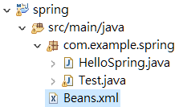

<a href="/spring/">Spring</a> >>
<a href="/spring/spring_page1/">Spring 簡介</a> >>
<a href="/spring/spring_page2/" style="color:palevioletred;background-color:papayawhip;">Spring HelloSpring 範例</a> >>
<div class="divider"></div>
首先，開啟 Eclpise 然後 Import 一個 Maven project : [New] -> [Project] -> [Maven Project]

Group Id : com.example

Artifact Id : spring


### 利用 Maven 匯入 Spring Dependencies
接下來可以利用 Maven 專案的 POM 檔匯入所有 Spring 需要的 jar 檔。目前只是單純的 Java application，這裡匯入 spring-context 相關的 dependency 即可。

**<a href="https://mvnrepository.com/artifact/org.springframework/spring-context/4.3.9.RELEASE" target="_blank">spring-context 4.3.9.RELEASE</a>**

然後在 Maven 專案的 pom 檔匯入相關資源
```
<dependency>
    <groupId>org.springframework</groupId>
    <artifactId>spring-context</artifactId>
    <version>4.3.9.RELEASE</version>
</dependency>
```
匯入的 dependency 應該包含以下 highlight 的資源


如果與 Spring 框架的 module 來說，目前只用到了 core container，但此核心容器同時也是 Spring 最核心最重要的一塊。


### HelloSpring.java & Test.java
接下來我們 src file 的 package 底下 `com.example.spring create` 兩個 class，分別叫做 `HelloSpring.java` 以及 `Test.java`，然後分別寫入以下程式 : 

HelloSpring.java
```
package com.example.spring;

public class HelloSpring {
	private String message;

	public void setMessage(String message) {
		this.message = message;
	}

	public void getMessage() {
		System.out.println("Your Message : " + message);
	}
}
```
Test.java
```
package com.example.spring;

import org.springframework.context.ApplicationContext;
import org.springframework.context.support.ClassPathXmlApplicationContext;

public class Test {
   public static void main(String[] args) {
      ApplicationContext context = new ClassPathXmlApplicationContext("Beans.xml");
      HelloSpring obj = (HelloSpring) context.getBean("helloSpring");
      obj.getMessage();
   }
}
```
### Bean 設定檔
最後需要再 src file 的目錄底下建一個 `Bean.xml` 檔，寫入以下程式 :



Bean.xml
```
<?xml version="1.0" encoding="UTF-8"?>

<beans xmlns = "http://www.springframework.org/schema/beans"
   xmlns:xsi = "http://www.w3.org/2001/XMLSchema-instance"
   xsi:schemaLocation = "http://www.springframework.org/schema/beans
   http://www.springframework.org/schema/beans/spring-beans-3.0.xsd">

   <bean id = "helloSpring" class = "com.example.spring.HelloSpring">
      <property name = "message" value = "Hello Spring!"/>
   </bean>

</beans>
```
完成後可以執行(run) `Test.java`，正確結果應該為以下結果 : 
```
Your Message : Hello Spring!
```

### 說明 -- 我剛剛到底寫了什麼??
首先要說明 `HelloSpring.java`，它就是一個很一般的class，更可以視為一個 POJO (Plain old Java Object)，有 getter 和 setter。
再來看 `Test.java`，其中 import 了 **<a href="https://docs.spring.io/spring/docs/current/javadoc-api/org/springframework/context/ApplicationContext.html" target="_blank">ApplicationContext</a>** 以及 **<a href="https://docs.spring.io/spring/docs/current/javadoc-api/org/springframework/context/support/ClassPathXmlApplicationContext.html" target="_blank">ClassPathXmlApplicationContext</a>**。

ApplicationContext(**<a href="https://spring.io/understanding/application-context" target="_blank">請看這</a>**) 是整個 Spring 框架的
