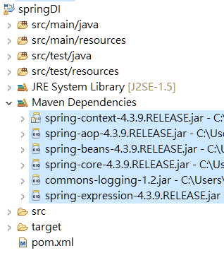
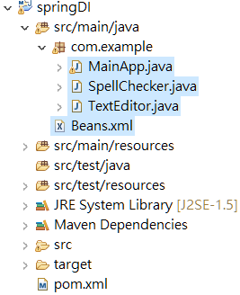

<a href="/spring/">Spring</a> >>
<a href="/spring/spring_page1/">Spring 簡介</a> >>
<a href="/spring/spring_page2/">Spring Container</a> >> <a href="/spring/spring_page3/">Spring Beans</a> >> <a href="/spring/spring_page4/" style="color:palevioletred;background-color:papayawhip;">Dependency Injection</a>
<div class="divider"></div>

### 何謂 Dependency Injection?

Dependency Injection (DI)(**<a href="https://stackoverflow.com/questions/130794/what-is-dependency-injection?noredirect=1&lq=1" target="_blank">資料參考</a>**) 是一種設計模式(design pattern)，這種設計模式的理念在於希望將程式裡皮此之間的關係或依賴性降到最低(loose-coupling 低耦合性)。

```
class Animal{
	Monkey monkey = new Monkey();
}
```
一個 Animal Class 如果要用到 Monkey Class 的物件，它可以使用 `new` 的 keyword 來產生，但這意味著兩個 Animal 和 Monkey 的耦合度(依賴性)相對高，而同時因為 monkey 物件是由 Animal 負責產生的，在某種意義上你可以說 Animal 背負著需要產生 Monkey 的責任，然後假設 Monkey Class 因為什麼原因而消失或是被異動了，那 Animal 是會受到影響的。以上結論可以體會到使用此方法來獲得 Dependency 會造成相對高的依賴關係，對於 Unit testing 也會造成不方便。

Dependency Injection 可翻譯成"依賴注入"，從字面上去解釋，就是希望把一個 Class 所需要的東西，從外部來獲得，可以想成反正外面有人會幫我把我要的東西"注入"進來給我用，我要用的時候只要跟它拿就好，不需要自己建立，以剛剛範例來解釋的話，當我 Animal 要產生 Monkey 時，我就從外部去要，它就會給我，我 Animal 跟 Monkey 的關係就沒有那麼大，負責建立 Monkey 物件的也不是我(Animal)，所以我也沒有要自己產生 Monkey 物件的責任了。話都說得很好聽，但要跟誰索取需要的東西，剛剛一直提到的"外部"又是誰?在哪裡?

Spring Dependency Injection 主要以下兩種 : 

| 注入種類                                 | 敘述                                          |
| ----------------------------------------|:----------------------------------------------|
| Constructor-based dependency injection  | Constructor-based dependency injection        |
| Setter-based dependency injection       | Setter-based dependency injection             |

### Constructor-based Dependency Injection
簡單來說 Constructor-based 的 DI 技巧為: 將所需要的元件在類別初始化的時候會 pass 進來

接著試著用實際範例來體驗建構子-based的依賴注入，範例直接參考自(**<a href="https://www.tutorialspoint.com/spring/constructor_based_dependency_injection.htm" target="_blank">tutorialspoint</a>**)

範例 : 先開一個 Maven 專案，在 Pom 檔匯入 Spring-Context 的 Dependency : 
```
<dependency>
    <groupId>org.springframework</groupId>
    <artifactId>spring-context</artifactId>
    <version>4.3.4.RELEASE</version>
</dependency>
```
Group Id : com.example
Artifact Id : springDI

目錄結構 : 



接下來，請在 `src/main/java` 底下建立一個 `com.example` 的 package 以及一個 `Beans.xml` 的設定檔，然後在 `com.example` 底下建立三個類別 : `TextEditor.java`、`SpellChecker.java`、`MainApp.java`。建好的目錄結構應該長這樣 : 



TextEditor.java : 

```
package com.example;

public class TextEditor {
   private SpellChecker spellChecker;

   public TextEditor(SpellChecker spellChecker) {
      System.out.println("Inside TextEditor constructor." );
      this.spellChecker = spellChecker;
   }
   public void spellCheck() {
      spellChecker.checkSpelling();
   }
}
```

SpellChecker.java : 

```
package com.example;

public class SpellChecker {
   public SpellChecker(){
      System.out.println("Inside SpellChecker constructor." );
   }
   public void checkSpelling() {
      System.out.println("Inside checkSpelling." );
   }
}
```

MainApp.java : 

```
package com.example;

import org.springframework.context.ApplicationContext;
import org.springframework.context.support.ClassPathXmlApplicationContext;

public class MainApp {
   public static void main(String[] args) {
      ApplicationContext context = new ClassPathXmlApplicationContext("Beans.xml");

      TextEditor te = (TextEditor) context.getBean("textEditor");
      te.spellCheck();
   }
}
```

Beans.xml : 

```
<?xml version="1.0" encoding="UTF-8"?>

<beans xmlns = "http://www.springframework.org/schema/beans"
   xmlns:xsi = "http://www.w3.org/2001/XMLSchema-instance"
   xsi:schemaLocation = "http://www.springframework.org/schema/beans
   http://www.springframework.org/schema/beans/spring-beans-3.0.xsd">

   <!-- Definition for textEditor bean -->
   <bean id = "textEditor" class = "com.example.TextEditor">
      <constructor-arg ref = "spellChecker"/>
   </bean>

   <!-- Definition for spellChecker bean -->
   <bean id = "spellChecker" class = "com.example.SpellChecker"></bean>

</beans>
```


 
### Setter-based dependency injection
